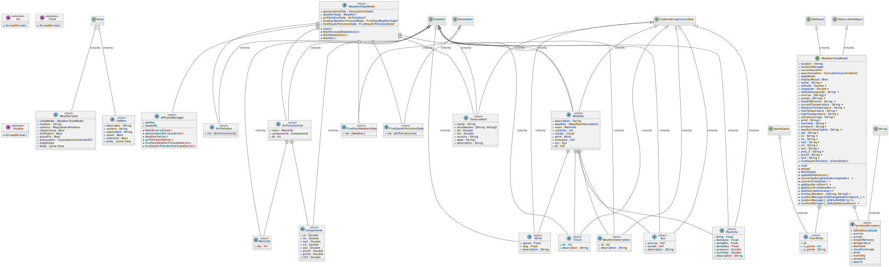

# iOS Weather App 

## Project Overview

### WeatherDataModel Implementation
- Manages current weather, air pollution, and 5-day forecasts.
- Properties include `geoLocationData`, `weatherData`, `airPollutionData`, `fiveDayWeatherForecastData`, and `fiveDayAirPollutionData`.
- Methods like `clear()` and `fetchData(lat:lon:)` for data manipulation.
  
### APICallsManager
- Struct for API calls to OpenWeather API.
- Properties: `apiKey` for authentication, `baseURL` for the API.
- Helper method `fetch(from asType:)` for asynchronous data fetching.
- Public API calls: geo-location, current weather, air pollution, 5-day weather forecast, and 5-day air pollution forecast.

### WeatherViewModel Implementation
- Async/await operations for responsive UI.
- SwiftUI integration as `ObservableObject` for automatic updates.
- Conforms to `CLLocationManagerDelegate` for location-related events.
- `SymbolsDirectory` enum centralizes UI symbol names.
- Extensions for number formatting (Int, Float, Double).

### WeatherView.swift
- Asynchronous operations using SwiftUI's async modifier and await keyword.
- Enhanced map interaction with tap gestures for dynamic weather updates.
- Search functionality for convenient location-based weather information.
- Detailed view for comprehensive weather details and forecasts.
- Line chart integration to visualize air quality index (AQI) forecast.

## Design Pattern: MVVM

- Follows the MVVM (Model-View-ViewModel) design pattern.
- Model manages data, View handles UI, and ViewModel manages presentation logic and data flow.

## UML Diagram

Include a UML diagram here to illustrate the class relationships and structure. Use a tool like [draw.io](https://draw.io/) or any other UML diagram tool.

## How to Implement

1. Clone the repository: `git clone https://github.com/mushiboy/SwiftUI-Weather-App.git`
2. Open the project in Xcode.
3. Build and run the app on a simulator or device.

For any additional setup or configuration details, refer to the code comments and documentation within the project.

## Acknowledgments

- Special thanks to the contributors and the [OpenWeather API](https://openweathermap.org/) for providing weather-related data.

**Project Contributors:** [Mugesh SP](https://www.linkedin.com/in/mugeshsp/)

Feel free to explore the code for detailed comments and code organization. For any questions or issues, please reach out to the project contributors.
